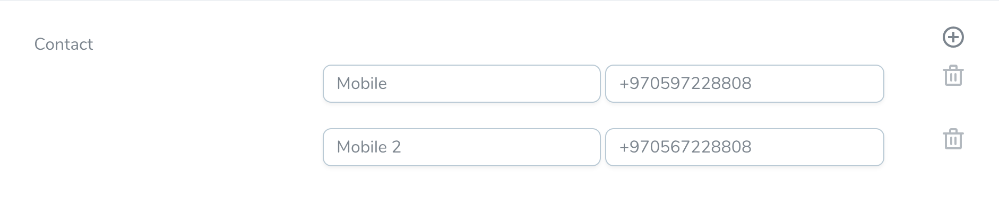
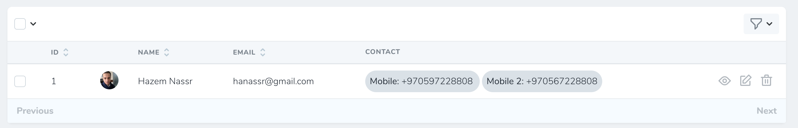
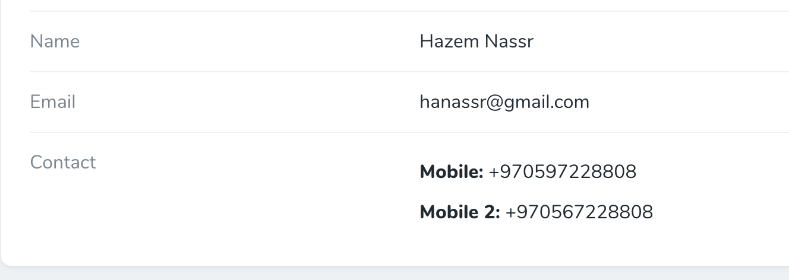

# Nova KeyValue

[](https://packagist.org/packages/hnassr/nova-key-value)

[](https://travis-ci.org/hnassr/nova-key-value)
[](https://scrutinizer-ci.com/g/hnassr/nova-key-value)
[](https://packagist.org/packages/hnassr/nova-key-value)


This package add to key value field

## Screenshots




## Installation

You can install the package in to a Laravel app that uses [Nova](https://nova.laravel.com) via composer:

```bash
composer require hnassr/nova-key-value
```

```php
KeyValue::make('Contact')
```

## Contributing

Please see [CONTRIBUTING](CONTRIBUTING.md) for details.

### Security

If you discover any security related issues, please email hanassr@gmail.com instead of using the issue tracker.

## Credits

- [Hazem Nassr](https://github.com/hnassr)

## License

The MIT License (MIT). Please see [License File](LICENSE.md) for more information.
